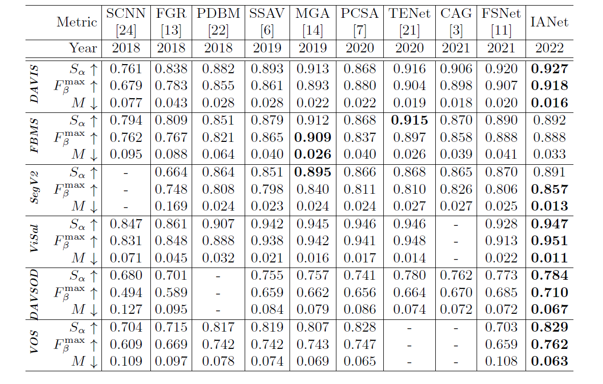

# IANet
Official code repository for paper **Local-Global Interaction and Progressive Aggregation for Video Salient Object Detection** ([ICONIP 2022](https://easychair.org/proceedings/paper_download.cgi?paper=595433;a=29637379;kind=pdf))

<p align="center">
     <br />
 <em> 
     Overall architecture of the proposed IANet.
    </em>
</p>

## Usage

**Each dataset corresponds to a txt path file, with each row arranged by img_path, gt_path and flow_path.**

## Training
1. Download the training dataset (containing DAVIS16, DAVSOD and DUTS-TR) from [Baidu Driver](https://pan.baidu.com/s/1F2RrcgJylUMYkWiUAoaL2A) (PSW:wuqv).
2. Download the pre_trained ResNet34 [backbone](https://download.pytorch.org/models/resnet34-333f7ec4.pth) to your specified folder.
3. The training of entire model is implemented on a NVIDIA TITAN X (Pascal) GPU:
- Run `python main.py --mode=train`

## Testing
1. Download the test dataset  (containing DAVIS16, DAVSOD, FBMS, SegTrack-V2, VOS and ViSal) from [Baidu Driver](https://pan.baidu.com/s/1F2RrcgJylUMYkWiUAoaL2A) (PSW:wuqv).
2. Download the final trained model from [Baidu Driver](https://pan.baidu.com/s/1IPwwghNX4GrBOgKWT2NO0w) (PSW:u9wa).
3. Run `python main.py --mode=test`.

## Result
1. The saliency maps can be download from [Baidu Driver](https://pan.baidu.com/s/15KvCtIZ8BQ3zhdkVVf73wg) (PSW: u76y).
2. Evaluation Toolbox: We use the standard evaluation toolbox from [DAVSOD benchmark](https://github.com/DengPingFan/DAVSOD).

<p align="center">
     <br />
 <em> 
    Quantitative comparisons with SOTA methods on five public VSOD datasets in term of three evaluation metrics. 
     The best results are highlighted in bold.
    </em>
</p>

## Citation
Please cite the following paper if you use this repository in your research:
```
@article{min2022ianet,
  title={Local-Global Interaction and Progressive Aggregation for Video Salient Object Detection},
  author={Min, Dingyao and Zhang, Chao and Lu, Yukang and Fu, Keren and Zhao, Qijun},
  booktitle={The International Conference on Neural Information Processing},
  year={2022}
}
```
